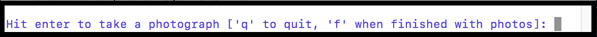

Photo documentation  

## Overview

Photo documentation for this project is carried out to aid in description and cataloging of the asset when the original object is in off-site storage.

Data that the photographs will capture include:  

* Information related to the program/content.  
* Information about the medium.  
* Information about how the medium has been formatted.  
* Condition

Parts of te original object that are photographed may include:   
   
* Containers (media cases, boxes, etc.).  
* Media Housing (reels, shells, etc.).  
* Paper documents in or on the object's container or housing (paper inserts, detatched labels, etc.).  

##Workflow 

Photo documentation takes place as part of the `ingestfile -a` process [LINK TO INGESTFILE WORKFLOW].  For photo documentation, follow the related ingestfile -a prompts and respond with the following comands:

Enter: Take a photo.  
q: Quit ingestfile.  
f: Finish the photo documentation and finalize the ingestfile -a package.  

*Example, `ingestfile -a` prompt*

 
  
## Examples

*Example, container front cover*. 

*Example, container front spine*

*Example, container inside cover*

*Example, spine*.  

   
   
*Example, reel*.   

*Example, paper insert*. 

